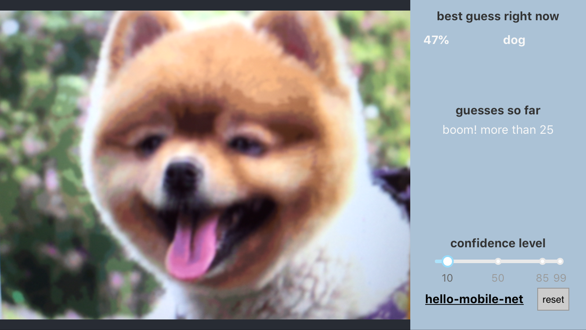
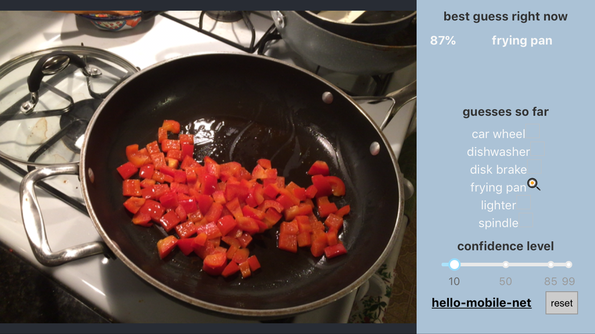

# hello-mobile-net
fiddling with mobile net predictions in tensorflow.js

adapted from https://github.com/google/emoji-scavenger-hunt/

read more at https://medium.com/tensorflow/a-look-at-how-we-built-the-emoji-scavenger-hunt-using-tensorflow-js-3d760a7ebfe6

### Demo
https://hello-mobile-net.herokuapp.com/

### Development
`$ yarn start`

This project was bootstrapped with [Create React App](https://github.com/facebook/create-react-app).

### repl.it
https://repl.it/@kevinrobinson/NormalMiserlyWorkspace almost works, but I couldn't figure out how to upload binary files to repl.it.  Fetching models from https://hello-mobile-net.herokuapp.com/ or emoji scavenger hunt leads to errors since they don't allow cross-origin requests.

but no reason not to put these on a repl!